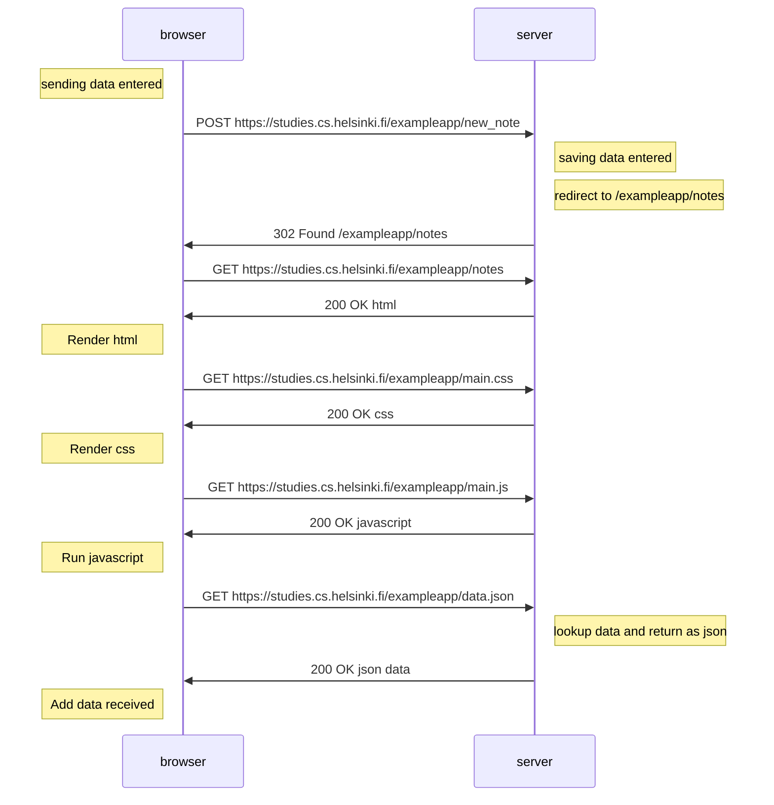

```mermaid
sequenceDiagram
    participant browser
    participant server
    Note left of browser: sending data entered
    browser->>server: POST https://studies.cs.helsinki.fi/exampleapp/new_note
    Note right of server: saving data entered
    Note right of server: redirect to /exampleapp/notes 
    server->>browser: 302 Found /exampleapp/notes
    browser->>server: GET https://studies.cs.helsinki.fi/exampleapp/notes
    server->>browser: 200 OK html
    Note left of browser: Render html
    browser->>server: GET https://studies.cs.helsinki.fi/exampleapp/main.css
    server->>browser: 200 OK css
    Note left of browser: Render css
    browser->>server: GET https://studies.cs.helsinki.fi/exampleapp/main.js
    server->>browser: 200 OK javascript
    Note left of browser: Run javascript
    browser->>server: GET https://studies.cs.helsinki.fi/exampleapp/data.json
    Note right of server: lookup data and return as json
    server->>browser: 200 OK json data
    Note left of browser: Add data received
```